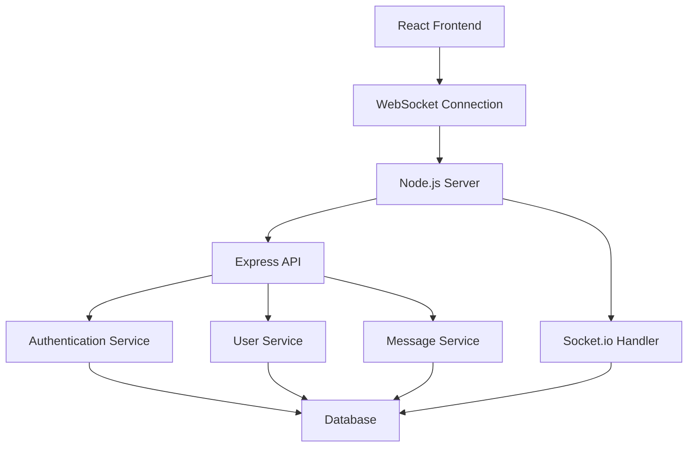

# Design Document

## Overview

The AOL Instant Messenger clone will be built as a real-time web application using modern technologies while maintaining the authentic 90s AIM experience. The system will use WebSocket connections for real-time messaging, a React-based frontend that recreates the classic AIM interface, and a Node.js backend with persistent data storage.

## Architecture

The application follows a client-server architecture with real-time communication capabilities:



### Technology Stack
- **Frontend**: React with TypeScript, CSS modules for authentic styling
- **Backend**: Node.js with Express and Socket.io for real-time communication
- **Database**: SQLite for development, PostgreSQL for production
- **Authentication**: JWT tokens with session management
- **Real-time**: Socket.io for WebSocket connections

## Components and Interfaces

### Frontend Components

#### 1. Authentication Components
- `LoginWindow`: Classic AIM login dialog with screen name and password fields
- `RegistrationWindow`: New user registration with validation
- `SplashScreen`: Nostalgic AIM loading screen

#### 2. Main Interface Components
- `BuddyList`: Main window showing online/offline contacts with groups
- `ChatWindow`: Individual chat conversations with classic styling
- `ProfileWindow`: User profile display and editing
- `PreferencesWindow`: Settings for sounds, appearance, and behavior

#### 3. UI Components
- `WindowFrame`: Reusable window component with classic AIM styling
- `StatusIndicator`: Online/away/offline status icons
- `SoundManager`: Handles classic AIM sound effects

### Backend Services

#### 1. Authentication Service
```typescript
interface AuthService {
  register(screenName: string, password: string, email: string): Promise<User>
  login(screenName: string, password: string): Promise<AuthToken>
  validateToken(token: string): Promise<User>
  logout(userId: string): Promise<void>
}
```

#### 2. User Service
```typescript
interface UserService {
  getUserById(id: string): Promise<User>
  getUserByScreenName(screenName: string): Promise<User>
  updateUserStatus(userId: string, status: UserStatus): Promise<void>
  updateProfile(userId: string, profile: UserProfile): Promise<void>
}
```

#### 3. Buddy Service
```typescript
interface BuddyService {
  addBuddy(userId: string, buddyScreenName: string): Promise<void>
  removeBuddy(userId: string, buddyId: string): Promise<void>
  getBuddyList(userId: string): Promise<Buddy[]>
  updateBuddyStatus(userId: string, status: UserStatus): Promise<void>
}
```

#### 4. Message Service
```typescript
interface MessageService {
  sendMessage(fromUserId: string, toUserId: string, content: string): Promise<Message>
  getConversationHistory(user1Id: string, user2Id: string): Promise<Message[]>
  markMessagesAsRead(userId: string, conversationId: string): Promise<void>
}
```

## Data Models

### User Model
```typescript
interface User {
  id: string
  screenName: string
  email: string
  passwordHash: string
  profile: UserProfile
  status: UserStatus
  lastSeen: Date
  createdAt: Date
}

interface UserProfile {
  displayName?: string
  location?: string
  interests?: string
  awayMessage?: string
}

enum UserStatus {
  ONLINE = 'online',
  AWAY = 'away',
  INVISIBLE = 'invisible',
  OFFLINE = 'offline'
}
```

### Message Model
```typescript
interface Message {
  id: string
  fromUserId: string
  toUserId: string
  content: string
  timestamp: Date
  isRead: boolean
}
```

### Buddy Relationship Model
```typescript
interface BuddyRelationship {
  id: string
  userId: string
  buddyId: string
  groupName?: string
  addedAt: Date
}
```

## Real-time Communication

### WebSocket Events

#### Client to Server Events
- `user:connect` - User comes online
- `user:disconnect` - User goes offline
- `user:status-change` - User changes status
- `message:send` - Send instant message
- `buddy:add` - Add new buddy
- `buddy:remove` - Remove buddy

#### Server to Client Events
- `buddy:online` - Buddy comes online
- `buddy:offline` - Buddy goes offline
- `buddy:status-change` - Buddy status update
- `message:receive` - Receive instant message
- `buddy:added` - New buddy added to list

### Connection Management
- Maintain user session mapping to socket connections
- Handle reconnection scenarios gracefully
- Implement heartbeat mechanism for connection health
- Clean up resources on disconnect

## Error Handling

### Frontend Error Handling
- Network connectivity issues with retry mechanisms
- Invalid user input validation with helpful error messages
- WebSocket connection failures with automatic reconnection
- Authentication errors with clear user feedback

### Backend Error Handling
- Database connection failures with graceful degradation
- Invalid API requests with appropriate HTTP status codes
- WebSocket connection errors with cleanup procedures
- Rate limiting for message sending to prevent spam

### Error Response Format
```typescript
interface ErrorResponse {
  error: {
    code: string
    message: string
    details?: any
  }
}
```

## Testing Strategy

### Unit Testing
- Frontend component testing with React Testing Library
- Backend service testing with Jest
- Database model validation testing
- WebSocket event handler testing

### Integration Testing
- API endpoint testing with supertest
- WebSocket communication testing
- Database integration testing
- Authentication flow testing

### End-to-End Testing
- User registration and login flows
- Real-time messaging between users
- Buddy list management operations
- Status change notifications

### Performance Testing
- WebSocket connection load testing
- Database query performance testing
- Message delivery latency testing
- Concurrent user capacity testing

## Security Considerations

### Authentication Security
- Password hashing with bcrypt
- JWT token expiration and refresh
- Session management and cleanup
- Rate limiting on login attempts

### Data Protection
- Input sanitization for all user data
- SQL injection prevention
- XSS protection in message content
- CSRF protection for API endpoints

### WebSocket Security
- Token-based WebSocket authentication
- Message validation and sanitization
- Connection rate limiting
- Proper error handling without information leakage